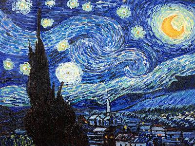
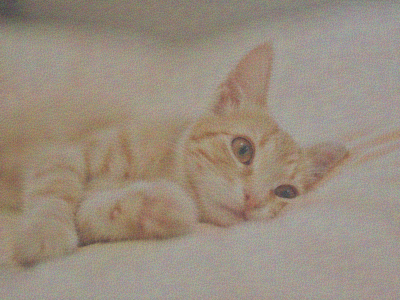
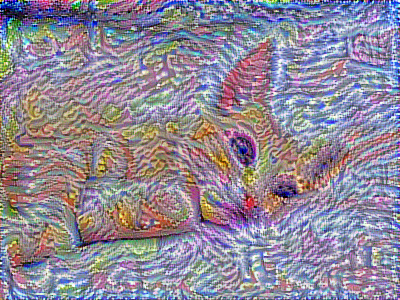
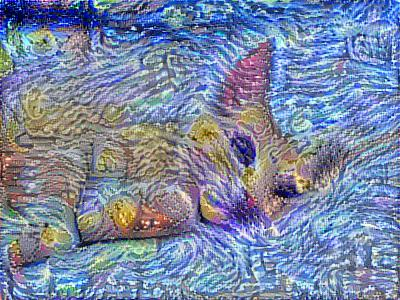

# NeuralStyleTransfer-tensorflow

Implementation of Neural Style Transfer from the paper [A Neural Algorithm of Artistic Style](http://arxiv.org/abs/1508.06576) in Tensorflow

### Requirements

* tensorflow-gpu==1.4.0
* tqdm==4.23.0
* scikit-image==0.13.1

### Usage

* Create folder named `pretrained_model`
* Download [pretrained VGG 19](http://www.vlfeat.org/matconvnet/models/imagenet-vgg-verydeep-19.mat) and put it into `pretrained_model` folder
* Open terminal and type the command
* Command usage: 

```
python  nst.py [-h] -c CONTENT_IMG -s STYLE_IMG [-o OUTPUT_FOLDER]
              [-n N_ITERATIONS] [-e SAVE_EVERY_N_ITERATIONS] [-f OUTPUT_NAME]
              [-p PRETRAINED_MODEL] [-a ALPHA] [-b BETA] [-lr LEARNING_RATE]
              [-ht HEIGHT] [-w WIDTH] [-ch CHANNELS]
```

* Command arguments:

```
  -h, --help            show this help message and exit
  -c CONTENT_IMG, --content_img CONTENT_IMG
                        path to content image
  -s STYLE_IMG, --style_img STYLE_IMG
                        path to style image
  -o OUTPUT_FOLDER, --output_folder OUTPUT_FOLDER
                        path to output folder
  -n N_ITERATIONS, --n_iterations N_ITERATIONS
                        number of iterations
  -e SAVE_EVERY_N_ITERATIONS, --save_every_n_iterations SAVE_EVERY_N_ITERATIONS
                        every n iterations the model will save an output image
  -f OUTPUT_NAME, --output_name OUTPUT_NAME
                        output image name
  -p PRETRAINED_MODEL, --pretrained_model PRETRAINED_MODEL
                        path to pretraned model
  -a ALPHA, --alpha ALPHA
                        importance of content cost
  -b BETA, --beta BETA  importance of style cost
  -lr LEARNING_RATE, --learning_rate LEARNING_RATE
                        learning rate
  -ht HEIGHT, --height HEIGHT
                        height of image
  -w WIDTH, --width WIDTH
                        width of image
  -ch CHANNELS, --channels CHANNELS
                        channels of image
```

### Example

#### Content image:

[example/cat2.jpg](example/cat2.jpg)


#### Style image: 

[example/starry_night.jpg](example/starry_night.jpg)



#### Command line:

```
python nst.py -c example/cat2.jpg -s example/starry_night/jpg -n 400 -e 100
```

#### Result:

* Iteration 0:

[output/generated_0.png](output/generated_0.png)



* Iteration 100:

[output/generated_100.png](output/generated_100.png)



* Iteration 200:

[output/generated_200.png](output/generated_200.png)


* Iteration 300:

[output/generated_300.png](output/generated_300.png)


* Final (Iteration 400):

[output/generated.jpg](output/generated.jpg)



### References

* [A Neural Algorithm of Artistic Style](http://arxiv.org/abs/1508.06576)
* [Convolutional Neural Networks by deeplearning.ai](https://www.coursera.org/learn/convolutional-neural-networks)

## Tensorflow神经风格迁移

用Tensorflow实现神经风格迁移， 论文：[A Neural Algorithm of Artistic Style](http://arxiv.org/abs/1508.06576)

### 环境要求

* tensorflow-gpu==1.4.0
* tqdm==4.23.0
* scikit-image==0.13.1

### 使用方法

### 例子 

### 参考

* [A Neural Algorithm of Artistic Style](http://arxiv.org/abs/1508.06576)
* [deeplearning.ai 卷积神经网络](https://www.coursera.org/learn/convolutional-neural-networks)
